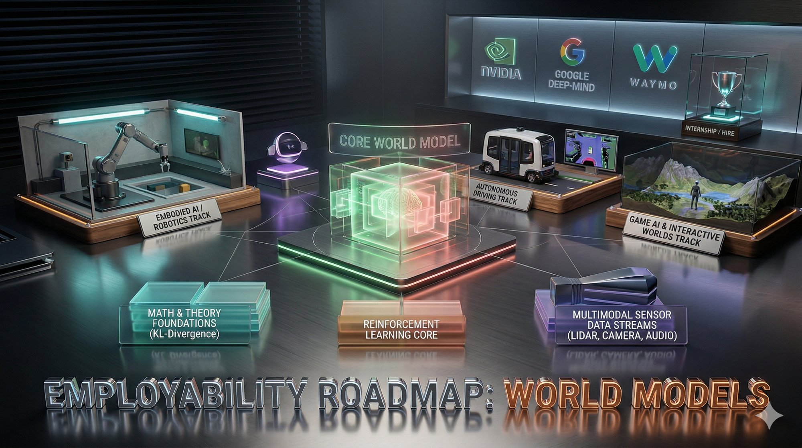
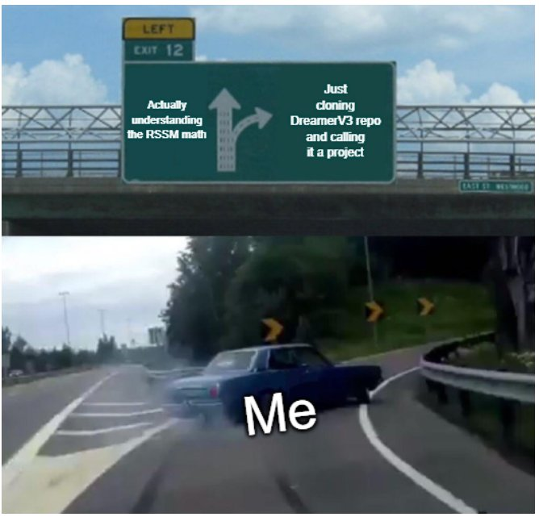
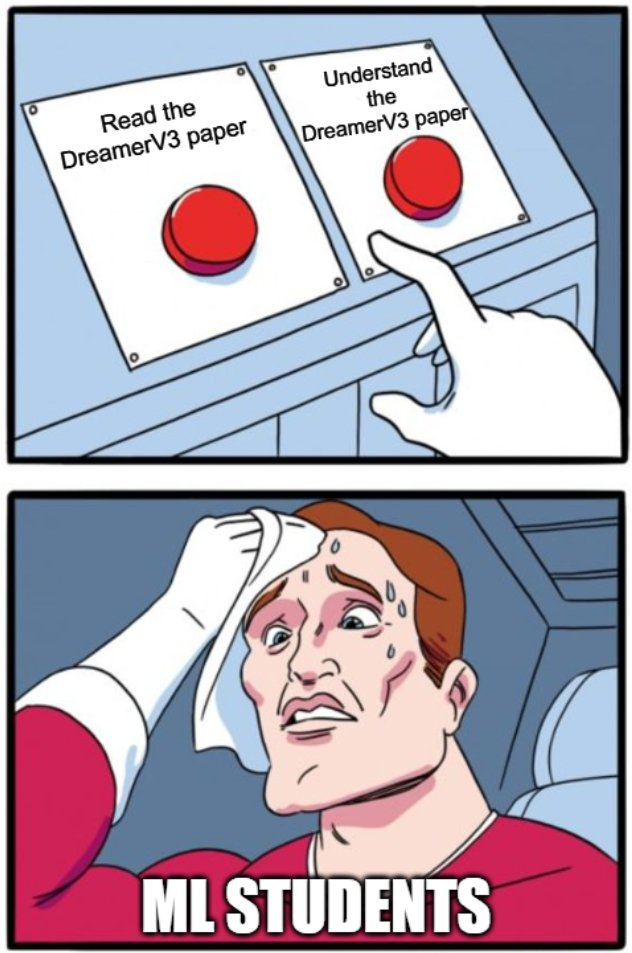
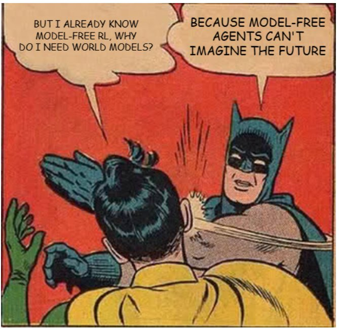

<div align="center">

# 🌍 Awesome World Models \& RL - A Curated Employability Roadmap

[](https://github.com/sindresorhus/awesome) [](https://github.com/sandesh-8622/awesome-world-models-rl-roadmap/stargazers) [](LICENSE) [](CONTRIBUTING.md)

**📜 A Curated Roadmap to Mastering World Models \& Reinforcement Learning — and Getting Hired at Frontier AI Labs and Robotics Companies.**

<p align="center">
  
</p>

*Visual generated with* [*Google Gemini*](https://gemini.google.com)

</div>

\---

<div align="center">

<table>
  <tr>
    <td align="center"></td>
    <td align="center"></td>
    <td align="center"></td>
  </tr>
</table>

*(If you don't get these memes yet, keep reading — you will.)*

</div>

\---

## 📋 Overview

* 🎯 [Why World Models Right Now?](#-why-world-models-right-now)
* 🗺️ [The Path at a Glance](#️-the-path-at-a-glance)
* 🔵 [Phase 1 — The Foundation](#-phase-1--the-foundation)
* 🟡 [Phase 2 — Core World Models](#-phase-2--core-world-models)
* 🖥️ [Scalable ML Systems](#️-scalable-ml-systems--the-missing-layer)
* 🔴 [Phase 3 — Specialize \& Ship](#-phase-3--specialize--ship)
* 🛠️ [Portfolio Projects](#️-portfolio-projects--what-actually-gets-you-hired)
* 🧰 [Tools \& Environments](#-tools--environments)
* 📺 [Lectures Worth Your Time](#-lectures-worth-your-time)
* 📚 [Books](#-books)
* 🏢 [Target Companies \& Internships](#-target-companies--internships)
* 🤝 [How to Stay Current](#-how-to-stay-current)
* ✅ [Self-Assessment Checkpoints](#-self-assessment-checkpoints)
* ⚡ [The Most Important Advice](#-the-most-important-advice)

\---

## 🎯 Why World Models Right Now?

World Models sit at the intersection of **generative AI, reinforcement learning, and robotics** — three of the highest-growth, highest-paying areas in tech. The core idea is powerful: instead of reacting to the world directly, an intelligent agent builds an *internal model* of how the world works, then uses that model to **predict, imagine, and plan** before taking action.

Think about what this unlocks:

* A robot that can mentally simulate "what happens if I push this object?" before touching it
* A self-driving car that imagines 10 different futures before choosing a lane
* A game AI that learns entirely by dreaming inside its own model — never touching the real game

This is not a niche academic topic. **Every major AI lab and robotics company is racing to build better world models.** The field is young enough that a motivated person with the right foundation can compete with PhDs — if they build real things and show their work.

The gaps the field is actively trying to fill:

* **Sample efficiency**: Model-free RL needs millions of environment interactions. World models reduce this dramatically by letting agents learn from imagined experience.
* **Generalization**: Systems that understand *how* the world works generalize better than systems that memorize patterns.
* **Safety**: You can test dangerous scenarios inside a model before deploying to the real world.
* **Multi-task**: A single world model can support many downstream tasks — planning, prediction, generation — without retraining.

People who understand how to build and train world models are rare and highly paid. This roadmap is designed to make you one of them.

\---

## 🗺️ The Path at a Glance

```
Phase 1 — Build the Foundation       (Do NOT skip this — it is the most leveraged time you will spend)
Phase 2 — Core World Models          (Where you become genuinely dangerous)
Scalable ML Systems                  (What separates people who understand models from people who can run them)
Phase 3 — Specialize \& Ship          (What actually gets you hired)
```

Work through each phase fully before moving to the next. The single most common reason people plateau in this field is skipping Phase 1. The math and RL vocabulary are not optional — they appear in every paper, every codebase, every interview.

\---

## ⚡ The Highest-ROI Principle

**Depth beats breadth — always.** Recruiters and research teams don't care how many papers you've read. They care whether you can implement a complex system from scratch, debug it when it breaks, and extend it with new ideas. Every resource in this list was chosen through that lens.

\---

## 🔵 Phase 1 — The Foundation

### 🔬 Research Meta-Skills — Start Here

Before you read your first paper, learn *how* to read one. This sounds trivial. It is not. Most people read papers the wrong way — linearly, slowly, without a strategy — and either get lost in the math or miss the core insight entirely. These two resources fix that permanently.

* [⭐️] **How to Read a Paper** — S. Keshav. [](https://web.stanford.edu/class/ee384m/Handouts/HowtoReadPaper.pdf)
The canonical three-pass method: (1) skim for structure and decide if the paper is worth reading, (2) read carefully without getting stuck on proofs, (3) deep read to reconstruct the argument from scratch. Required reading at Michigan's CSE 585 (Advanced Scalable Systems for Agentic AI) and many top research courses. Do this before reading anything else in this roadmap.

* **How to Give a Bad Talk** — David Patterson. [](https://people.eecs.berkeley.edu/~pattrsn/talks/BadTalk.pdf)
Framed as anti-advice, this is the most concise guide to giving good technical presentations. Relevant once you start presenting your project work or attending conferences.

> **Why this matters here:** Every paper in Phases 2 and 3 is dense. Without a reading strategy you will spend 4 hours on a paper and retain 20% of it. With Keshav's method you get 80% in 1 hour and deep-read only what you genuinely need.

---

### 📐 Mathematics

You need *comfort*, not perfection. Focus on intuition over proofs. These four areas appear constantly in world model papers.

* **Linear Algebra** — [](https://www.youtube.com/playlist?list=PLZHQObOWTQDPD3MizzM2xVFitgF8hE_ab)
The visual intuition that every other resource assumes you have. Vectors, matrices, eigenvectors, SVD. Do not skip even if you've taken a course — 3B1B builds the geometric understanding that pure computation misses.
* **Probability \& Statistics** — [](https://projects.iq.harvard.edu/stat110/home)
You cannot read a world models paper without probability. Conditional distributions, Bayes' theorem, expectations — these are in every loss function.
* **Multivariable Calculus** — [](https://ocw.mit.edu/courses/18-02-multivariable-calculus-fall-2007/)
Gradients, Jacobians, chain rule in multiple dimensions. Needed to understand backpropagation through time and through stochastic variables.
* **Information Theory (basics)** — [](https://www.wiley.com/en-us/Elements+of+Information+Theory%252C+2nd+Edition-p-9780471241959)
KL divergence appears in *every* world model loss function — VAE ELBO, DreamerV3's KL balancing, RSSM training. Understand it intuitively before moving on.

> \*\*Gut-check:\*\* Can you derive backpropagation by hand? Can you explain KL divergence and why minimizing it is useful? Can you explain what an eigenvalue means geometrically? That's your bar.

\---

### 🧠 Deep Learning Core

* \[⭐️] **Andrej Karpathy: Neural Networks Zero to Hero** — [](https://www.youtube.com/playlist?list=PLAqhIrjkxbuWI23v9cThsA9GvCAUhRvKZ) [](https://karpathy.ai/zero-to-hero.html)
**Mandatory. Do this first.** The best bottom-up, from-scratch deep learning education in existence. You build micrograd (autograd engine), bigram models, and GPT from scratch. After this series you understand *why* everything works, not just *how* to use it.
* **fast.ai Practical Deep Learning** — [](https://course.fast.ai/)
Balances theory with real hands-on building from day 1. Excellent for CNNs, transfer learning, and the practical tricks that make models actually train.
* **Deep Learning Book — Goodfellow, Bengio, Courville** — [](https://www.deeplearningbook.org/)
Read Ch. 1–9. Foundations of optimization, regularization, CNNs, RNNs. Dense but authoritative — use as reference.

> ⭐ \*\*Build this:\*\* Implement a character-level language model from scratch following Karpathy's series. Push to GitHub with a clean README. This proves more than a transcript.

\---

### 🎮 Reinforcement Learning Core

World Models live *inside* RL. The agent uses the world model to imagine futures, then RL to learn a policy from those imagined futures. Without RL fluency, world model papers are unreadable.

* \[⭐️] **Sutton \& Barto — RL: An Introduction** — [](http://incompleteideas.net/book/RLbook2020.pdf)
**The** textbook. Read Ch. 1–8 (tabular methods, DP, Monte Carlo, TD) and Ch. 13 (policy gradients). Understanding the theory makes every deep RL paper dramatically easier.
* \[⭐️] **David Silver's UCL RL Course** — [](https://www.youtube.com/playlist?list=PLqYmG7hTraZBiG_XpjnPrSNw-1XQaM_gB)
Best video lectures in existence. By the AlphaGo author. Lectures 1–9 are essential.
* **Spinning Up in Deep RL — OpenAI** — [](https://spinningup.openai.com/en/latest/) [](https://github.com/openai/spinningup)
Clean implementations of PPO, SAC, TD3. Read the code — don't just run it.
* **CS285 Deep RL — UC Berkeley** — [](https://rail.eecs.berkeley.edu/deeprlcourse/)
Best advanced RL course. **Lecture 12 (Model-Based RL) is mandatory.**

> ⭐ \*\*Build this:\*\* Train a PPO agent from scratch on `LunarLanderContinuous-v2` or `HalfCheetah-v4`. Document your hyperparameter search — what broke, what worked, why.

\---

### 🐍 Python + PyTorch Proficiency

* **PyTorch Official Tutorials** — [](https://pytorch.org/tutorials/)
Complete the 60-minute blitz, custom datasets, and sequence-to-sequence tutorials.
* **Karpathy's micrograd** — [](https://github.com/karpathy/micrograd)
Build your own autograd engine. The single best exercise for understanding what `loss.backward()` actually does.
* **labml.ai Annotated Papers** — [](https://nn.labml.ai/)
Line-by-line annotated implementations. Use as reference when reading model code.

\---

## 🟡 Phase 2 — Core World Models

This is where you separate yourself from everyone who just "does machine learning." World models require combining generative modeling, sequential decision-making, and latent variable models — most people have pieces but not the full picture.

### 📄 The 5 Foundational Papers — Read These in Order

These papers define what a World Model *is* and trace the evolution to current state of the art. Read them before anything else in this phase. Read with a pen — annotate, question, derive.

* \[⭐️] **World Models** — Ha \& Schmidhuber, 2018. The paper that started everything. A VAE encodes observations into a compact latent space; an MDN-RNN models transitions in that latent space; a tiny controller learns a policy using only the latent state. The agent learns to *play inside its own dream*. [](https://arxiv.org/abs/1803.10122) [](https://worldmodels.github.io/)
* \[⭐️] **A Path Towards Autonomous Machine Intelligence** — LeCun, 2022. LeCun's blueprint for the next generation of AI — JEPA, energy-based models, and the argument that prediction in representation space is the right abstraction. Defines the intellectual agenda of half the field. [](https://openreview.net/pdf?id=BZ5a1r-kVsf)
* \[⭐️] **Dream to Control (DreamerV1)** — Hafner et al., 2020. First end-to-end world model trained *purely in latent space*. Introduces the RSSM — the architecture all subsequent Dreamer variants use. The agent never trains on real rewards — it trains entirely on imagined rollouts. [](https://arxiv.org/abs/1912.01603) [](https://danijar.com/project/dreamer/)
* \[⭐️] **Mastering Atari with Discrete World Models (DreamerV2)** — Hafner et al., 2021. Introduces categorical latent variables via straight-through gradients. More stable training. First world model to match model-free SOTA on Atari. [](https://arxiv.org/abs/2010.02193) [](https://github.com/danijar/dreamerv2)
* \[⭐️] **Mastering Diverse Domains in World Models (DreamerV3)** — Hafner et al., 2023. The current gold standard. One set of hyperparameters works across Atari, DMControl, Minecraft, and robot manipulation. Introduces symlog predictions, free bits KL balancing, return normalization. **Read this paper multiple times.** [](https://arxiv.org/abs/2301.04104) [](https://github.com/danijar/dreamerv3)

> ⭐ \*\*The flagship project:\*\* Implement DreamerV3 from scratch on DMControl Suite. Read the code line by line. Understand every design choice: why symlog? why free bits? what breaks without KL balancing? Document training curves, ablations, and visualize imagined rollouts as GIFs.

\---

### 🏗️ Architecture Building Blocks

#### Latent State Space Models (the engine of most world models)

* \[⭐️] **RSSM: Recurrent State Space Model** — Hafner et al., 2019. The architecture inside all Dreamer variants. Combines a deterministic GRU path (stable long-range memory) with a stochastic latent path (capturing uncertainty). Understanding why *both* are needed — and what fails with only one — is fundamental. [](https://arxiv.org/abs/1811.04551)
* **Mamba** — Gu et al., 2023. State space models challenging transformer dominance on long sequences. Linear-time complexity. Increasingly appearing in world model architectures. [](https://arxiv.org/abs/2312.00752) [](https://github.com/state-spaces/mamba)

#### Transformers as World Models

* \[⭐️] **IRIS: Transformers are Sample-Efficient World Models** — Micheli et al., 2023. Discrete tokenization via VQ-VAE + transformer as dynamics model. Beats Dreamer on Atari. Shows transformers can replace RSSMs. [](https://arxiv.org/abs/2209.00588) [](https://github.com/eloialonso/iris)
* **Gato** — Reed et al., DeepMind, 2022. A single transformer trained as a generalist agent across 600+ tasks — text, images, robot control, games. The LLM-as-world-model paradigm at scale. [](https://arxiv.org/abs/2205.06175)

#### Diffusion-Based World Models

* \[⭐️] **DIAMOND: Diffusion for World Modeling** — Alonso et al., 2024. Diffusion model as the dynamics model — pixel-perfect visual quality on Atari. Shows diffusion is viable as a dynamics model, not just a generator. [](https://arxiv.org/abs/2405.12399) [](https://github.com/eloialonso/diamond)
* \[⭐️] **GameNGen** — Valevski et al., Google, 2024. First real-time neural game engine — runs DOOM at 20 FPS purely via diffusion. The world model *is* the game. [](https://arxiv.org/abs/2408.14837)

#### JEPA — The LeCun School

* \[⭐️] **I-JEPA** — Assran et al., Meta, 2023. Predict in *representation space*, not pixel space — avoid reconstructing irrelevant details. The conceptual foundation for world models that don't waste capacity on pixels. [](https://arxiv.org/abs/2301.08243) [](https://github.com/facebookresearch/ijepa)
* **V-JEPA** — Bardes et al., Meta, 2024. JEPA for video — predicts future video representations without generating pixels. [](https://ai.meta.com/research/publications/revisiting-feature-prediction-for-learning-visual-representations-from-video/)

\---

### 🎨 Generative Models — Non-Negotiable

Modern world models are built on top of these. You cannot understand the dynamics model, decoder, or tokenizer without knowing these deeply.

* \[⭐️] **VAE — Variational Autoencoder** — Kingma \& Welling, 2013. Understand the ELBO derivation, reparameterization trick, and why KL divergence regularizes the latent space. Appears directly inside DreamerV1. [](https://arxiv.org/abs/1312.6114)
* \[⭐️] **VQ-VAE** — van den Oord et al., 2017. Discrete tokenization via vector quantization. The tokenizer inside IRIS, Gato, and most video world models. [](https://arxiv.org/abs/1711.00937)
* \[⭐️] **Diffusion Models (DDPM)** — Ho et al., 2020. The architecture underlying DIAMOND, GameNGen, and most video world models. [](https://arxiv.org/abs/2006.11239) [](https://lilianweng.github.io/posts/2021-07-11-diffusion-models/) [](https://huggingface.co/blog/annotated-diffusion)

\---

### 🎬 Video Generation as World Modeling

* \[⭐️] **Is Sora a World Simulator?** — Survey, 2024. Best overview of video generation as world modeling. Read first for big picture. [](https://arxiv.org/abs/2405.03520) [](https://github.com/GigaAI-research/General-World-Models-Survey)
* **GAIA-1** — Wayve, 2023. Generative world model for autonomous driving trained on real driving video. [](https://arxiv.org/abs/2309.17080)
* **iVideoGPT** — Wu et al., 2024. Scalable interactive video world models for robotics — conditions generation on actions. [](https://arxiv.org/abs/2405.15223) [](https://github.com/thuml/iVideoGPT)

\---

## 🖥️ Scalable ML Systems — The Missing Layer

**Most roadmaps stop at the algorithm. This section covers what frontier labs actually run.** Building a world model that works on your laptop is one thing. Running a DreamerV3-scale experiment on 256 GPUs, tracking 500 ablations, and serving a policy model at low latency for a real robot is a different skill entirely — and it is one that almost nobody teaches explicitly.

Every major lab (DeepMind, Physical Intelligence, NVIDIA Research, Wayve) runs on infrastructure built from the ideas below. Understanding these is increasingly what separates a strong ML intern candidate from a strong ML research engineer candidate.

> **Course reference:** [CSE 585: Advanced Scalable Systems for Agentic AI](https://github.com/mosharaf/cse585) — University of Michigan, taught by Mosharaf Chowdhury. The most relevant university course in existence for this exact topic. No textbook; all papers. Reading list used as a reference for the selections below.

---

### 🧱 System Design Foundations

These two resources build the vocabulary and mental models you need to reason about any large-scale system — AI or otherwise.

* [⭐️] **Hints and Principles for Computer System Design** — Butler Lampson. [](https://arxiv.org/abs/2011.02455)
The single best essay on how to think about system design tradeoffs. Lampson distills decades of building real systems into the STEADY framework — Simple, Timely, Efficient, Adaptable, Dependable, Yummy — plus the AID techniques (Approximate, Incremental, Divide & Conquer). Required at CSE 585. Slow read; worth every minute.

* [⭐️] **The System Design Primer** — donnemartin. [](https://github.com/donnemartin/system-design-primer)
The most comprehensive open-source reference for scalable system design concepts: CAP theorem, consistency patterns, load balancing, caching, database sharding, message queues, and more. Foundational vocabulary for any systems conversation at a frontier lab. Start with the [Harvard Scalability Lecture](https://www.youtube.com/watch?v=-W9F__D3oY4) linked inside it, then read the primer itself selectively.

* **Latency Numbers Every Programmer Should Know** — Jeff Dean / originally Peter Norvig. [](https://github.com/donnemartin/system-design-primer#latency-numbers-every-programmer-should-know)
Memorize the order of magnitude of L1 cache, RAM, SSD, and network round-trip latencies. These numbers determine whether a design decision is sensible or absurd, and interviewers at hardware-adjacent labs (NVIDIA, Waymo) will expect you to reason with them.

---

### 🏋️ Distributed Training

Training a large world model is a parallelism problem. Understanding how gradient synchronization, pipeline stages, and tensor shards work across hundreds of GPUs is what allows you to debug training runs that don't converge and design experiments that fit in your compute budget.

* [⭐️] **Efficient Large-Scale Language Model Training on GPU Clusters Using Megatron-LM** — Narayanan et al., NVIDIA, 2021. [](https://arxiv.org/abs/2104.04473)
The definitive paper on 3D parallelism for large model training: tensor, pipeline, and data parallelism combined. The architecture underlying how NVIDIA trains foundation models at scale. Required at CSE 585.

* **Zero Bubble (Almost) Pipeline Parallelism** — Qi et al., 2023. [](https://arxiv.org/abs/2401.10241)
Eliminates most pipeline bubbles through schedule rearrangement — directly relevant for anyone designing training runs on 100+ GPUs.

* **Alpa: Automating Inter- and Intra-Operator Parallelism** — Zheng et al., 2022. [](https://arxiv.org/abs/2201.12023)
Automatic partitioning of computation graphs across devices. Shows how to think about the search space of parallelism strategies systematically.

---

### ⚡ Distributed RL Training at Scale

Directly relevant to world models: training a policy via imagined rollouts is a distributed RL problem at scale. These papers show how frontier labs solve it.

* [⭐️] **AReaL: A Large-Scale Asynchronous Reinforcement Learning System** — 2025. [](https://arxiv.org/abs/2503.18919)
Asynchronous RL for language reasoning at scale — shows the infrastructure pattern for running actor/learner/rollout workers asynchronously. The design directly maps to world model training where rollout generation and model updates can be decoupled.

* **DeepSeek-R1: Incentivizing Reasoning Capability via RL** — DeepSeek, 2025. [](https://arxiv.org/abs/2501.12948)
The paper that made GRPO mainstream. Shows how to get strong reasoning from RL alone, without SFT warmup — directly relevant to world model training where the agent learns from imagined rollouts. Required at CSE 585.

---

### 🚀 Inference & Serving Systems

Once you build a world model, deploying it efficiently matters — especially in robotics, where latency directly affects whether the robot acts safely. Understanding serving systems also helps you design world models with practical deployment constraints in mind.

* [⭐️] **Orca: A Distributed Serving System for Transformer-Based Generative Models** — Yu et al., 2022. [](https://arxiv.org/abs/2207.04836)
Introduces continuous batching — the foundational technique behind all modern LLM serving. Required at CSE 585.

* [⭐️] **Efficient Memory Management for Large Language Model Serving with PagedAttention (vLLM)** — Kwon et al., 2023. [](https://arxiv.org/abs/2309.06180) [](https://github.com/vllm-project/vllm)
KV-cache paging analogous to OS virtual memory. The paper that made vLLM the standard serving framework. Required at CSE 585. If you're deploying any generative model, you're likely using or competing with this.

* **DistServe: Disaggregating Prefill and Decoding** — Zhong et al., 2024. [](https://arxiv.org/abs/2401.09670)
Separates the prefill and decoding stages of LLM inference onto different hardware to optimize goodput — the kind of systems thinking that directly applies to world model serving where imagination (prefill-like) and action (decoding-like) can be disaggregated.

---

### 🏗️ Infrastructure & Datacenter Context

Understanding the hardware and infrastructure context that ML runs on is increasingly expected at frontier labs. These are the foundational references.

* **The Datacenter as a Computer** — Barroso, Hölzle & Ranganathan (Chapters 1–2). [](https://pages.cs.wisc.edu/~markhill/restricted/barroso_holzle_2007.pdf)
How modern datacenters are designed, what their efficiency constraints are, and why distributed systems look the way they do. The mental model every serious ML engineer needs when thinking about compute costs and scaling decisions.

* **Machine Learning Fleet Efficiency: Analyzing and Optimizing Large-Scale Google TPU Systems** — Google, 2024. [](https://research.google/pubs/ml-fleet-efficiency/)
How Google optimizes ML productivity across a fleet of TPUs. Introduces "goodput" (the fraction of time doing useful ML computation) — the right lens for evaluating training infrastructure.

---

### 📖 Classic Distributed Systems Papers — The Bedrock

These are the foundational papers that distributed ML systems are built on top of. You don't need to implement them, but you should know what problem each solves and why it mattered. Sourced from the [Scalable-Software-Architecture](https://github.com/binhnguyennus/awesome-scalability) reference list.

| Paper | Why It Matters |
|-------|---------------|
| **MapReduce** — Dean & Ghemawat, Google, 2004 | The paradigm for distributed data processing. Underlies how ML datasets are preprocessed at scale. [](http://research.google.com/archive/mapreduce-osdi04.pdf) |
| **The Google File System (GFS)** — Ghemawat et al., 2003 | How to store petabytes reliably across commodity hardware. Ancestor of HDFS and the storage layer under every large-scale ML pipeline. [](http://research.google.com/archive/gfs-sosp2003.pdf) |
| **Bigtable** — Chang et al., 2006 | Distributed structured storage. Mental model for how training metadata, checkpoints, and experiment logs are stored at scale. [](http://research.google.com/archive/bigtable-osdi06.pdf) |
| **Dynamo** — DeCandia et al., Amazon, 2007 | Highly available key-value store. The CAP theorem in practice — directly informs how you reason about consistency in distributed training. [](http://www.allthingsdistributed.com/files/amazon-dynamo-sosp2007.pdf) |
| **Large-scale cluster management at Google with Borg** — Google, 2015 | How Google schedules workloads across clusters — the predecessor of Kubernetes, which underlies most ML infrastructure. [](http://static.googleusercontent.com/media/research.google.com/en//pubs/archive/43438.pdf) |

> **Note on scope:** The Scalable-Software-Architecture repo contains hundreds of links on web-company scaling (Twitter, Instagram, Facebook). Most are too general for this context. The five papers above are the subset with direct relevance to AI systems thinking.

---

## 🔴 Phase 3 — Specialize \& Ship

**The market rewards depth. Pick ONE track and go deep.** Generalists don't get research internships. Being "good at ML" is not a differentiator — being the person who deeply understands robot world models, or driving world models, or game world models, is.

\---

### 🤖 Track A: Embodied AI \& Robotics

*(Highest industry demand right now — new companies forming every month)*

The core gap: robots still fail at tasks humans do trivially. A robot that can *imagine* the consequences of its actions is dramatically more capable than one reacting blindly. World models are the missing piece.

**Companies actively hiring:**

|Company|Focus|What They Want|
|-|-|-|
|**NVIDIA** (GR00T, Isaac Lab)|Foundation models for humanoid robots|PyTorch, robotics sim, world models|
|**Google DeepMind**|RT-2, Gemini Robotics, manipulation|Research depth, publications|
|**Physical Intelligence (π)**|General-purpose robot policies|RL + generative models + real robot exp|
|**Figure AI**|Humanoid for industrial use|ML Research, hardware-ML boundary|
|**1X Technologies**|Humanoid robots|Embodied AI research|
|**Boston Dynamics**|Atlas, Spot|Perception, planning, control|
|**Agility Robotics**|Digit humanoid for logistics|Locomotion, manipulation ML|
|**Apptronik**|Apollo humanoid|Whole-body control|
|**Skild AI**|General robot intelligence|Research Scientist|
|**Covariant**|Robot manipulation for warehouses|RL, generative models|
|**Intrinsic (Google X)**|Robot software platform|Robotics ML, planning|

**VLA Backbone Papers — Know These Before Any Interview:**

- [⭐️] **RT-1: Robotics Transformer** — Google, 2022. The paper that kicked off the modern VLA era. A transformer trained on 130k real robot demonstrations achieving generalization across 700+ tasks. The architecture everyone builds on top of. [](https://arxiv.org/abs/2212.06817) [](https://robotics-transformer.github.io/)

- [⭐️] **RT-2: Vision-Language-Action Models** — Google DeepMind, 2023. Repurposes a large vision-language model as a robot policy — web knowledge transfers directly to physical manipulation. The paper that made "VLA" a standard term. [](https://arxiv.org/abs/2307.15818) [](https://robotics-transformer2.github.io/)

- [⭐️] **Open X-Embodiment (RT-X)** — Google et al., 2023. 22 robot types, 527 skills, 160,000 tasks — the ImageNet moment for robotics data. The dataset and model that made cross-embodiment generalization a real research direction. [](https://arxiv.org/abs/2310.08864) [](https://robotics-transformer-x.github.io/)

**Grounding & Planning — Seminal Papers:**

- [⭐️] **SayCan** — Google, 2022. Grounds LLM planning in robot affordances — the LLM proposes what to do, a value function scores what is actually *possible*. One of the most cited robotics papers of the decade. [](https://arxiv.org/abs/2204.01691) [](https://say-can.github.io/)

- **Code-as-Policies** — Google, 2022. Uses LLMs to write robot policy code directly — hierarchical, composable, and interpretable. The foundation for LLM-as-planner systems you'll see at every major lab. [](https://arxiv.org/abs/2209.07753) [](https://code-as-policies.github.io/)

**Papers:**

* \[⭐️] **EnerVerse** — 2025. Best recent world model for robot manipulation. [](https://arxiv.org/abs/2501.01895)
* \[⭐️] **FLARE** — NVIDIA, 2025. World model embedded inside a VLA — current SOTA design pattern. [](https://arxiv.org/abs/2505.15659)
* **RoboDreamer** — 2024. Compositional world models for generalizable robot imagination. [](https://arxiv.org/abs/2404.12377)
* **ManiGaussian** — 2024. 3D-aware world model using Gaussian splatting for manipulation. [](https://arxiv.org/abs/2403.08321)
* **AdaWorld** — 2025. Latent action learning and cross-embodiment transfer. [](https://arxiv.org/abs/2503.18938)
* **CoT-VLA** — 2025. Visual chain-of-thought for robots — reasoning through imagined futures before acting. [](https://arxiv.org/abs/2503.22020)

**Also learn:** ROS2 basics, MuJoCo, Genesis, Isaac Sim/Lab, Open X-Embodiment, AgiBot World, BridgeData V2.

📖 **Track Survey:** [](https://arxiv.org/abs/2510.16732) A Comprehensive Survey on World Models for Embodied AI

\---

### 🚗 Track B: Autonomous Driving

*(Large industry, mature research, significant hiring volume)*

The gap: AV systems struggle with long-tail rare events. A world model trained on vast driving video can generate synthetic rare scenarios, plan over imagined futures, and generalize to unseen conditions.

**Companies actively hiring:**

|Company|Focus|What They Want|
|-|-|-|
|**Waymo**|Full autonomy, robotaxi|Perception, world models, planning|
|**Wayve**|GAIA world models for AV|World model research, ML engineer|
|**NVIDIA** (Cosmos, Drive)|Foundation models for AV|Research scientist, AV ML|
|**Tesla**|FSD, Dojo, occupancy networks|ML research, data engine|
|**Mobileye**|AV chips + software|Perception, prediction|
|**Aurora**|Self-driving trucking|Prediction, planning ML|
|**Zoox** (Amazon)|Robotaxi|Perception, world models|
|**Motional** (Hyundai + Aptiv)|Robotaxi|ML research|
|**Applied Intuition**|AV simulation tooling|Simulation, scenario generation|
|**Comma.ai**|Open-source driving assistant|ML engineer|
|**Foretellix**|AV scenario generation|ML, world models|

**Papers:**

* \[⭐️] **GAIA-2** — Wayve, 2025. Controllable multi-view driving world model. Current SOTA. [](https://arxiv.org/abs/2503.20523)
* \[⭐️] **Cosmos Drive Dreams** — NVIDIA, 2025. World foundation model for scalable synthetic driving data. [](https://arxiv.org/abs/2506.09042)
* **DriveDreamer** — 2023. Foundational driving world model conditioned on HD maps and text. [](https://arxiv.org/abs/2309.09777)
* **OccWorld** — 2023. 3D occupancy forecasting as a world model. [](https://arxiv.org/abs/2311.16038)
* **UniSim** — 2023. Neural closed-loop sensor simulator as world model for AV training. [](https://arxiv.org/abs/2308.01545)

**Also learn:** BEV representations, nuScenes dataset, Waymo Open Dataset, sensor fusion, occupancy prediction.

📖 **Track Survey:** [](https://arxiv.org/abs/2501.11260) A Survey of World Models for Autonomous Driving

\---

### 🎮 Track C: Game AI \& Interactive Worlds

*(Emerging, high upside, lowest competition)*

The gap: neural world models that understand game physics can generate novel content, enable far-horizon planning, and eventually replace hand-crafted game engines with learned ones. This is early — opportunities for people who establish expertise now are large.

**Companies actively hiring:**

|Company|Focus|What They Want|
|-|-|-|
|**Google DeepMind**|GameNGen, game world models|Research Scientist|
|**Microsoft Research**|Game AI, world models|Research Scientist|
|**Electronic Arts (EA)**|AI-driven game content|ML Research, Game AI|
|**Ubisoft La Forge**|AI research for games|Research Scientist|
|**World Labs**|Spatial intelligence, world models|ML Research|
|**Decart**|Oasis: Minecraft world model|ML Engineer, Research|
|**Odyssey**|Interactive world models|ML Research|
|**Keen Technologies** (Carmack)|General AI research|Research|

**Papers:**

* \[⭐️] **GameNGen** — Google, 2024. Neural game engine running DOOM at 20 FPS. The paper that launched this track as a serious research direction. [](https://arxiv.org/abs/2408.14837)
* \[⭐️] **DIAMOND** — 2024. Best visual quality for game world modeling. Study the open-source code. [](https://arxiv.org/abs/2405.12399) [](https://github.com/eloialonso/diamond)
* **Oasis** — Decart, 2024. Minecraft as a world model — interactive, real-time, playable. [](https://oasis-model.github.io/)
* **Matrix-Game** — 2025. Open-source real-time interactive world model. [](https://arxiv.org/abs/2506.18701)

\---

## ⚠️ Robot Safety & Alignment — Know This Exists

Frontier labs (DeepMind, Physical Intelligence, NVIDIA) are increasingly asking about safety-aware robotics in interviews. You don't need to specialize here, but you should know the landscape.

| Paper | Why It Matters |
|-------|---------------|
| **RoboPAIR** — 2025 | First systematic jailbreaking of LLM-controlled robots. Shows why safety can't be bolted on. [](https://arxiv.org/abs/2410.13691) |
| **RoboGuard** — 2025 | Safety guardrails for LLM-enabled robots using a grounded world model. [](https://arxiv.org/abs/2503.07885) |
| **Robots Enact Malignant Stereotypes** — 2022 | The canonical paper on emergent bias in language-grounded robot systems. [](https://arxiv.org/abs/2207.11569) |

> Being able to discuss *why* safety matters for embodied systems — not just for LLMs — is a meaningful differentiator in research interviews.

---

## 🛠️ Portfolio Projects — What Actually Gets You Hired

Recruiters screen by GitHub. **Depth over breadth.** Three strong projects beats ten shallow ones.

### Project 1 — DreamerV3 from Scratch ⭐ (Most Important)

**Goal:** Implement the full DreamerV3 architecture on DMControl Suite.
**Build:** RSSM (deterministic + stochastic paths), world model decoder, KL balancing, actor-critic in latent space, symlog predictions.
**Document:** Training curves on 2+ tasks, ablations (remove stochastic state, remove KL balancing), imagined rollouts as GIFs.

> This single project, done properly and documented clearly, will open more doors than five half-baked projects. Hiring managers at frontier labs will ask you to walk through it in detail.

\---

### Project 2 — Interactive Pixel World Model

**Goal:** Train a small interactive world model on a video game — Atari or a 2D game you build.
**Show:** Next-frame generation conditioned on controller actions. RL agent learning a policy *entirely inside* your model.
**Stack:** PyTorch, VQ-VAE tokenizer, transformer dynamics model.

\---

### Project 3 — Domain-Specific Project (Pick Your Track)

|Track|Project|
|-|-|
|**Robotics**|Train a world model on BridgeData V2 or DROID. Visualize predicted manipulation futures. Show generalization to out-of-distribution object positions.|
|**Autonomous Driving**|BEV occupancy forecasting on nuScenes. Compare model-based vs. model-free closed-loop planning. Visualize predicted occupancy grids.|
|**Game AI**|Use DIAMOND's code on a different Atari game than in the paper. Write a technical blog post on what transferred and what didn't.|

\---

### Project 4 — A Mini Research Contribution

**Goal:** Find one specific gap in an existing open-source world model and propose + test a fix.

**Examples:**

* Replace the RSSM in DreamerV3 with a Mamba state-space model — does it improve long-horizon prediction?
* Add structured memory to a navigation world model — does it help in partial observability?
* Benchmark DreamerV3 under distribution shift — how gracefully does it degrade?
* Test whether KL balancing transfers to a new domain without retuning

This becomes your research sample for PhD programs or research positions. A negative result, documented carefully, shows research maturity.

\---

## 🧰 Tools \& Environments

|Tool|Purpose|Priority|
|-|-|-|
|**PyTorch**|Primary deep learning framework|Day 1|
|**Weights \& Biases (wandb)**|Experiment tracking, visualization|Day 1|
|**Gymnasium / Farama**|Standard RL environment API|Phase 1|
|**MuJoCo / DMControl**|Continuous control benchmarks|Phase 2|
|**JAX + Flax/Optax**|Used heavily at Google DeepMind|Phase 2+|
|**Isaac Lab**|NVIDIA GPU-accelerated robotics sim|Robotics track|
|**Genesis**|Fast physics simulator gaining traction|Robotics track|
|**ManiSkill3**|GPU-parallelized manipulation benchmark, widely used in research|Robotics track|
|**Habitat 2.0**|Facebook's home-assistant simulation environment|Robotics track|
|**Hugging Face**|Model hub, datasets, training tools|Throughout|
|**Git + GitHub**|Non-negotiable. Clean commit history.|Day 1|

\---

## 📺 Lectures Worth Your Time

|Lecture|Link|Why|
|-|-|-|
|**David Silver's RL Course**|[](https://www.youtube.com/playlist?list=PLqYmG7hTraZBiG_XpjnPrSNw-1XQaM_gB)|Foundational RL. Lectures 1–9 essential.|
|**CS285 Deep RL — Berkeley**|[](https://rail.eecs.berkeley.edu/deeprlcourse/)|Lecture 12 (Model-Based RL) is mandatory.|
|**DeepMind RL Series 2021**|[](https://deepmind.com/learning-resources/reinforcement-learning-series-2021)|From the people building Dreamer.|
|**World Model Workshop at Mila**|[](https://world-model-mila.github.io/)|Bengio, LeCun, Schmidhuber, Sherry Yang. Watch all.|
|**Yann LeCun: Autonomous Machine Intelligence**|[](https://www.youtube.com/watch?v=SGzMElJ11Cc)|The JEPA and energy-based model vision.|
|**Jim Fan: Foundation Models for Robotics**|[](https://www.youtube.com/watch?v=vK5DMhxnJ70)|How industry thinks about robot world models.|
|**Andrej Karpathy: State of GPT**|[](https://www.youtube.com/watch?v=bZQun8Y4L2A)|LLM architecture underlying modern world models.|

\---

## 📚 Books

|Book|Read For|Link|
|-|-|-|
|**RL: An Introduction** — Sutton \& Barto|Core RL theory. Read Ch. 1–9, 13.|[](http://incompleteideas.net/book/RLbook2020.pdf)|
|**Deep Learning** — Goodfellow et al.|Foundations. Especially Ch. 6, 9, 10.|[](https://www.deeplearningbook.org/)|
|**Probabilistic Machine Learning Vol. 1** — Kevin Murphy|VAEs, state-space models, Bayesian perspective.|[](https://probml.github.io/pml-book/book1.html)|

\---

## 🤝 How to Stay Current

|Resource|How to Use It|
|-|-|
|**arXiv cs.LG + cs.RO + cs.CV**|Skim titles daily, deep-read 1–2 papers/week. Keep a reading tracker.|
|**Hugging Face Papers**|[](https://huggingface.co/papers) Curated daily feed with community notes|
|**Papers With Code**|[](https://paperswithcode.com/task/world-model) Find implementations alongside papers|
|**Lilian Weng's Blog**|[](https://lilianweng.github.io) Best written technical summaries in the field|
|**Twitter/X**|Follow @DanijarHafner, @jimfan, @ylecun, @karpathy, @DrJimFan|

\---

## ✅ Self-Assessment Checkpoints

### 🔵 Foundation Complete

* \[ ] Can implement a neural network from scratch without libraries
* \[ ] Can train a PPO agent on CartPole and a continuous control task
* \[ ] Understands MDPs, Bellman equations, and policy gradients fluently — can explain them without notes
* \[ ] Has read and understood the original World Models paper — can explain MDN-RNN and VAE roles
* \[ ] Has 2 projects on GitHub with clear READMEs and training results

### 🟡 Core WM Mastery

* \[ ] Has implemented DreamerV3 (or studied the open-source version line-by-line with annotations)
* \[ ] Can explain RSSM, KL balancing, symlog predictions, and latent imagination from memory
* \[ ] Understands VAEs, VQ-VAEs, and diffusion models architecturally — can implement each
* \[ ] Has read all 5 foundational papers and can summarize each in 3 sentences
* \[ ] Has a domain-specific project producing real training results
* \[ ] Has applied to at least 3 research internships or RA positions
* \[ ] Understands what continuous batching (Orca) and KV-cache paging (vLLM) do and why they matter
* \[ ] Can explain the difference between tensor, pipeline, and data parallelism (Megatron-LM)

### 🔴 Job Ready

* \[ ] Has 3+ strong GitHub projects with training curves, ablations, and visualizations
* \[ ] Has at least one research internship or RA experience on resume
* \[ ] Can discuss tradeoffs between RSSM, transformers, and diffusion-based dynamics models
* \[ ] Has a reading list of 50+ papers with notes
* \[ ] Has attended or submitted to NeurIPS / ICLR / ICRA / CoRL
* \[ ] Has a personal website or blog with at least 3 substantive posts
* \[ ] Can discuss how distributed training (data/tensor/pipeline parallelism) applies to world model training
* \[ ] Understands how inference serving constraints shape model architecture choices

\---

## ⚡ The Most Important Advice

**1. Ship code to GitHub every week.** Consistent activity shows genuine work. An empty GitHub is a serious red flag.

**2. Read papers with a pen.** Ask: *What problem does this solve? What is the key architectural insight? What experiment would disprove this?*

**3. Go deep on one benchmark.** Pick DMControl or Atari. Know it better than anyone. Being "the person who has run 200 Dreamer experiments on HalfCheetah" is worth more than skimming 500 papers.

**4. Write about what you build.** Technical blog posts, README files, Twitter threads. Writing forces clarity and builds an audience, which builds opportunities. When you're ready to write for conferences or journals, watch Simon Peyton Jones's **[How to Write a Great Research Paper](https://www.microsoft.com/en-us/research/academic-program/write-great-research-paper/)** — the best concise guide to research writing in existence (also required at CSE 585).

**5. Email researchers directly.** Short and specific: *"I implemented your paper, changed X, and observed Y — was this expected?"* Response rates are higher than you think.

**6. Internships beat grades.** A research internship at a top lab is the single highest-leverage move you can make. Apply early, apply broadly, use cold emails and conference networking.

\---

## 🔗 Quick Reference

|Resource|Link|
|-|-|
|Original World Models paper|[](https://arxiv.org/abs/1803.10122)|
|DreamerV3 paper|[](https://arxiv.org/abs/2301.04104)|
|DreamerV3 open-source code|[](https://github.com/danijar/dreamerv3)|
|Spinning Up in Deep RL|[](https://spinningup.openai.com)|
|Sutton \& Barto (free)|[](http://incompleteideas.net/book/RLbook2020.pdf)|
|Awesome World Models (full paper list)|[](https://github.com/knightnemo/Awesome-World-Models)|
|Papers With Code — World Models|[](https://paperswithcode.com/task/world-model)|
|Lilian Weng's Blog|[](https://lilianweng.github.io)|
|CS285 Deep RL (Berkeley)|[](https://rail.eecs.berkeley.edu/deeprlcourse/)|
|World Model Workshop @ Mila|[](https://world-model-mila.github.io/)|
|**How to Read a Paper** — Keshav|[](https://web.stanford.edu/class/ee384m/Handouts/HowtoReadPaper.pdf)|
|**How to Write a Great Research Paper** — SPJ|[](https://www.microsoft.com/en-us/research/academic-program/write-great-research-paper/)|
|**CSE 585: Scalable Systems for Agentic AI** — UMich|[](https://github.com/mosharaf/cse585)|
|**The System Design Primer**|[](https://github.com/donnemartin/system-design-primer)|
|**Megatron-LM** (distributed training)|[](https://arxiv.org/abs/2104.04473)|
|**vLLM / PagedAttention** (inference)|[](https://arxiv.org/abs/2309.06180)|
|**Hints \& Principles for System Design** — Lampson|[](https://arxiv.org/abs/2011.02455)|

\---

## 📝 Acknowledgments \& Credits

Curated from:

* [Awesome World Models](https://github.com/knightnemo/Awesome-World-Models) by @knightnemo et al.
* [Awesome RL](https://github.com/aikorea/awesome-rl) by the aikorea team
* [Awesome LLM Robotics](https://github.com/GT-RIPL/Awesome-LLM-Robotics) by @zkira et al.
* [CSE 585: Advanced Scalable Systems for Agentic AI](https://github.com/mosharaf/cse585) — University of Michigan, Mosharaf Chowdhury
* [The System Design Primer](https://github.com/donnemartin/system-design-primer) — donnemartin
* [Scalable-Software-Architecture](https://github.com/binhnguyennus/awesome-scalability) — classic distributed systems references
* Community knowledge from NeurIPS, ICLR, ICRA, and CoRL workshops

Roadmap visual generated with [Google Gemini](https://gemini.google.com). Memes generated via [Imgflip](https://imgflip.com/memegenerator).

\---

*This is a living document. Focus on the fundamentals — they never go stale — and stay current on the application domain you have chosen.*

*If this helped you land an internship or job, consider contributing back by opening a PR.*

\---

<div align="center">

**⭐ Star this repo if it helped · 🍴 Fork it and make it your own · 🤝 PRs welcome**

</div>

